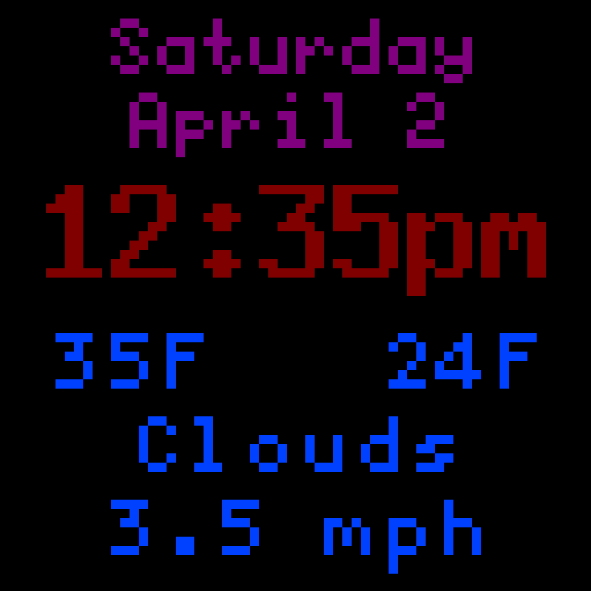
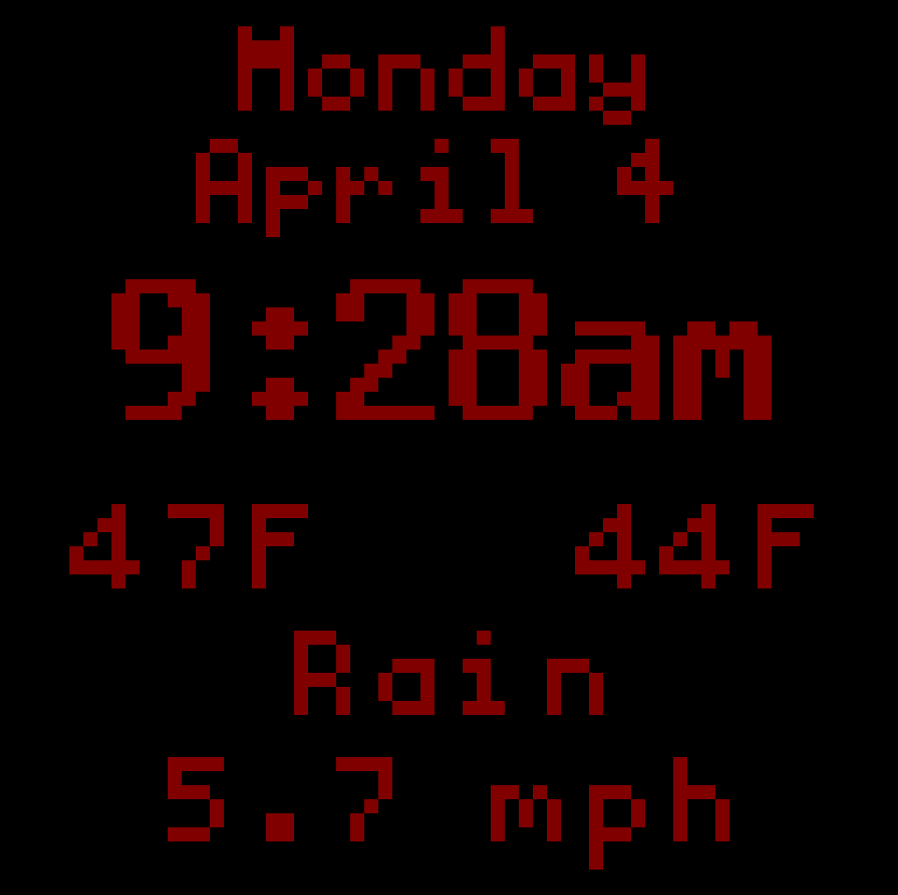

# MatrixClock
A clock program written in C++ that runs off of an RGB LED Matrix.

## Features
- Uses the [rpi-rgb-led-matrix](https://github.com/hzeller/rpi-rgb-led-matrix) library to easily write to the RGB Matrix
- Configurable JSON file to adjust what you want the display to look like
- OpenWeatherMap integration to allow displaying weather information
- Allows different displays at different times of the day

## Example Images
Default Clock Face


Dusk Clock Face


Night Time Clock Face


## Required Libraries
- [rpi-rgb-led-matrix](https://github.com/hzeller/rpi-rgb-led-matrix)
- [jsoncpp](https://github.com/open-source-parsers/jsoncpp)
- [libcurl](https://curl.se/libcurl/)

### Required Weather Portion:
1) Generate an API key from [OpenWeatherMap](https://openweathermap.org/)
2) Create a link to poll weather data from (will be used when you run the program)

## Installation
1) Install the required libraries listed above 
2) Clone this repository into the main directory of the matrix repository [here](https://github.com/hzeller/rpi-rgb-led-matrix) 
3) Run the "make" command
	* Note: if you are changing any of the RGB Matrix defaults in matrix_clock.cpp, do this before running "make"

## Running the Program
After running the "make" command it should generate a binary named "matrix_clock"
The program requires two arguments at runtime.
```
--WEATHER_URL <weather_url> - The OpenWeatherAPI key used to pull weather from
--CONFIG_FILE <config_file> - The JSON file that the clock faces will be read from
							  I would utilize the "matrix_config.json" file inside this repository. 
```
Full example:
```
./matrix_clock --WEATHER_URL https://api.openweathermap.org/data/2.5/weather?id=LOCATION&appid=API_KEYunits=imperial --CONFIG_FILE matrix_config.json
```
If you want to add any other command line arguments embedded within the matrix display's library you can also add them before or after the required arguments.

## Configuring matrix_config.json
The following is the default night time clock face in the program.
```
{
  "clock_faces": [
    {
      "name": "night",
      "time_periods": [
        {
          "start_hour": 2,
          "start_minute": 0,
          "end_hour": 8,
          "end_minute": 0
        }
      ],
      "text_lines": [
        {
          "color": {
            "built_in_color": "none",
            "r": 32,
            "g": 0,
            "b": 0
          },
          "font_size": "large_bold",
		  "x_position": -1,
          "y_position": 35,
          "text": "{hour}:{minute}{ampm}"
        }
      ]
    }
  ]
}
```

We can break this down into a few simple ways:

### Clock faces:
"clock_faces" is an array in which you will store all your clock faces. To add a clock face to the program just add a comma after the current one and declare a new one in the same format. To remove one, simply delete the block.
**NOTE:** There must be at least one clock face for the program to run

### Time Periods
Time periods is also an array with four arguments: start_hour, start_minute, end_hour, and end_minute. The hours must be in 24 hour format [0-23], and the minutes must be from [0-60] to function.
Every time the clock updates, it will check to see if it hits a new start time for a clock face and swap over to it if necessary.
If the program does not find a clock face for a specific time, it will show a blank screen on the matrix and warn the user once via console output (you could use this to your advantage if you want to display a blank screen during a time period).

### Text Lines
A text line represents a line of text visible on the matrix when the current clock face is active
A text line must have a **color**.
* This program has a couple declared hardcoded colors: red, orange, yellow, green, blue, purple, pink, white, gray, black, brown, and night_time (which is a darker red).
* If you do not wish to use one of the hardcoded colors, set the "built_in_color" field to "none" then fill in the rgb values with your intended color

A text line must also have a **font**.
* A font can be small, medium large, or large_bold.
* Custom fonts are not currently supported.

X and Y positions:
* The Y position represents the location where the BOTTOM of the line of text will be drawn. For example, if you printed out Hello at the position of 32, the bottom left pixel of the H would be at Y 32 and the rest of the text higher up.
* The X position represents where the line of text will start on the matrix in the horizontal axis.
	* You can set the X-position to -1 if you want the line of text to be centered (what I most recommend)

#### Text
Text is a little more complicated because you most likely want the data printed to be current weather and time information.
To make this easier I have created what I call *variables* to assist you in keeping the data updated.
Here is a list of the current variables:


| Variable | Description | 
| :---        |    :----   |
| {hour} | the current hour in 12 hour format|
| {hour24}   | the current hour in 24 hour format (0-23)|
| {minute}   |  the current minute|
| {second}   | the current second|
| {ampm}   | prints out am if it is before noon, pm if not
| {temp}   |the current temperature outside
| {temp_feel}   | the real feel outside|
| {temp_low}   | the low temperature for the day|
| {temp_high}   | the high temperature for the day|
| {humidity}   | the humidity outside|
| {forecast}   | the forecast outside (NOTE: this is typically too long to fit on the screen)|
| {forecast_short}   | a one word description of the weather outside (this can always fit on a screen)|
| {date_format}   | the date formatted in MM-DD-YYYY format
| {day_name}   | the current hour in 24 hour format (0-23)|
| {month_name}   | the name of the current month
| {month_day}   | the day of the month
| {week_day_num}   | the day of the week (where 0 is sunday, 1 is monday, etc)|
| {year}   | the current year

To use any of these variables, put them into the text field in the JSON file and they will update with the clock. You can also mix any form of constant text with a variable (for example: "{temp_feel}F" could put out "42F". If you are not interested in using any variables, constant text will still work perfectly fine.

There are multiple clock faces with different text, colors, and time periods in the default matrix_config.json, you can look to that for more examples.

After changing the configuration file, restart the program and it will immediately grab the data from it, no rebuilding the project necessary.