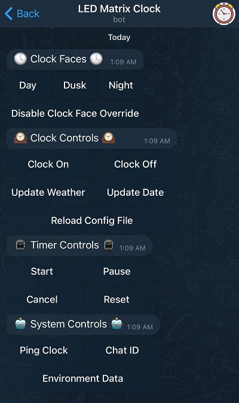

# MatrixClock
A clock program written in C++ that runs off of an RGB LED Matrix.

## Features
- Uses the [rpi-rgb-led-matrix](https://github.com/hzeller/rpi-rgb-led-matrix) library to easily write to the RGB Matrix
- Fully customizable with what you when you want text to display to display on the screen (days, time, or both)
- Configurable JSON file to adjust what you want the display to look like
- OpenWeatherMap integration to allow displaying weather information
- Allows different displays at different times of the day
- Telegram Integration that allows you to load clock faces from your phone, or force update to another display
- Ability to schedule texts through Telegram for any time of the day

## Example Images
Default Clock Face


Dusk Clock Face


Night Time Clock Face


## Required Libraries
- [rpi-rgb-led-matrix](https://github.com/hzeller/rpi-rgb-led-matrix)
- [jsoncpp](https://github.com/open-source-parsers/jsoncpp)
- [libcurl](https://curl.se/libcurl/)
- [tgbot-cpp](https://github.com/reo7sp/tgbot-cpp/)
- [wiringPi](https://github.com/WiringPi/WiringPi)

### Required Weather Portion:
1) Generate an API key from [OpenWeatherMap](https://openweathermap.org/)
2) Create a link to poll weather data from (will be used when you run the program)

## Installation
1) Install the required libraries listed above 
2) Clone this repository into the main directory of the matrix repository [here](https://github.com/hzeller/rpi-rgb-led-matrix) 
3) Run the "make" command
	* Note: if you are changing any of the RGB Matrix defaults in matrix_clock.cpp, do this before running "make"
4) Edit matrix_config.json to whatever values you please.
	a) Make sure you edit the weather URL and font_folder tab as needed, or the program will not run. If you do not wish to use the telegram bot, set the bot_token to "disabled" 

## Running the Program
After running the "make" command and configuring your json file you should see a binary named "matrix_clock"
The program requires two arguments at runtime.
```
--CONFIG <config_file> - The JSON file that the clock faces will be read from
				I would utilize the "matrix_config.json" file inside this repository. 
```
Full example:
```
./matrix_clock --CONFIG matrix_config.json
```
If you require different [command line arguments embedded within the matrix display's library](https://github.com/hzeller/rpi-rgb-led-matrix/tree/master/examples-api-use#running-some-demos), you should configure them at the top of matrix_config.json BEFORE running.

## Configuring matrix_config.json
The following is the default night time clock face in the program.
```
{
  "matrix_options": {
    "hardware_mapping": "adafruit-hat-pwm",
    "rows": 64,
    "cols": 64,
    "chain": 1,
    "parallel": 1,
    "brightness": 50,
    "refresh_rate_limit": 0,
    "gpio_slowdown": 3
  },
  "clock_data": {
    "weather_url": "https://api.openweathermap.org/data/2.5/weather?id=LOCATION&appid=API_KEYunits=imperial",
    "bot_token": "XXXXXXXXXX:XXXXXXXXXXXXXXXXXXXXXXXXXXXXXXXXXXX",
    "chat_id": 000000000,
    "fonts_folder": "/home/pi/rpi-rgb-led-matrix/fonts"
  },
  "clock_faces": [
    {
      "name": "night",
      "bg_color": {
        "built_in_color": "black",
        "r": 0,
        "g": 0,
        "b": 0
      },
      "time_periods": [
        {
          "start_hour": 2,
          "start_minute": 0,
          "end_hour": 8,
          "end_minute": 0,
          "days_of_week": [ 0, 1, 2, 3, 4, 5, 6 ]
        }
      ],
      "text_lines": [
        {
          "color": {
            "built_in_color": "none",
            "r": 32,
            "g": 0,
            "b": 0
          },
          "font_size": "large_bold",
	  "x_position": -1,
          "y_position": 35,
          "text": "{hour}:{minute}{ampm}"
        }
      ]
    }
  ],
  "timer": {  
    "display_time_while_ended": 30,  
    "blink": false,  
    "buzzer_pin": -1,
    "notify_on_complete": false,
    "bg_color": {  
      "built_in_color": "black",  
      "r": 0,  
      "g": 0,  
      "b": 0  
    },  
    "text_lines": [  
      {  
        "color": {  
          "built_in_color": "red",  
          "r": 0,  
          "g": 0,  
          "b": 0  
        },  
        "font_size": "large_bold",  
        "x_position": -1,  
        "y_position": 20,  
        "text": "{thour}:{tminute}:{tsecond}"  
      }  
    ]  
  },
  "telegram_notifications": [
    {
      "message": "It is currently {temp} degrees outside.",
      "hour": 8,
      "minute": 0,
      "days_of_week": [ 0, 1, 2, 3, 4, 5, 6 ]
    }
  ]
}
```
The top section labeled ```matrix_options``` consists of default configuration options for your RGB channel declared in hzeller's library. These settings must be configured at run time, and cannot be changed again without restarting the program.

We can break down the rest into a few simple ways:

### Clock Data:

#### Weather URL
The OpenWeatherAPI key used to pull weather from

In the following link, you would replace LOCATION with the number ID of your city (found by searching your city on [OpenWeatherMap](https://openweathermap.org/), searching your area, and pulling the 7 digits off of the URL.

Next you would replace API_KEY with the API key you generate by signing up for their API [in OpenWeatherMap's API page](https://openweathermap.org/api).

```https://api.openweathermap.org/data/2.5/weather?id=LOCATION&appid=API_KEYunits=imperial```

#### Bot Token

Here you would place the API key of your telegram bot (if you wish for it to be enabled in your program). You can generate an API key using the [BotFather](https://core.telegram.org/bots#6-botfather), then replace the placeholder in the config file with your API key.

If you do not want to use the telegram bot integration, simply put "disabled" in the ```bot_token``` field instead.

#### Font Folder

This is the file path for where all the matrix fonts are stored. For most people you will not have to change this if you cloned the rgb matrix's repository into your home folder, but if it is in some other location make sure you check that this file path is correct.

*Note: If text is not showing up in the matrix but there are no errors in console, check your file path for your fonts. It is possible the application just cannot find them*

### Clock Faces:
"clock_faces" is an array in which you will store all your clock faces. To add a clock face to the program just add a comma after the current one and declare a new one in the same format. To remove one, simply delete the block.
**NOTE:** There must be at least one clock face for the program to run

The clock face must have a declared name. This is the name that will be used within the telegram bot when you generate the inline keyboard.

The clock face must also have a defined background color. I recommend filling in "black" under the "built_in_color" field, though you can set it to "none" and fill in the rgb values as you wish. I go more into detail about the colors field under the "Text Lines" header.

#### Time Periods
Time periods is also an array with four arguments: start_hour, start_minute, end_hour, and end_minute. The hours must be in 24 hour format [0-23], and the minutes must be from [0-60] to function.

Time periods also have an array for the days of the week it is active. This allows you to have a clock face only run on specific days you want it to instead of every day. The array is filled with values raning from 0-6 (meaning Sunday (0) to Saturday (6)).

Every time the clock updates, it will check to see if it hits a new start time for a clock face and swap over to it if necessary.

If the program does not find a clock face for a specific time, it will show a blank screen on the matrix and warn the user once via console output (you could use this to your advantage if you want to display a blank screen during a time period).

#### Text Lines
A text line represents a line of text visible on the matrix when the current clock face is active
A text line must have a **color**.
* This program has a couple declared hardcoded colors: red, orange, yellow, green, blue, purple, pink, white, gray, black, brown, and night_time (which is a darker red).
* If you do not wish to use one of the hardcoded colors, set the "built_in_color" field to "none" then fill in the rgb values with your intended color

A text line must also have a **font**.
* A font can be small, medium, large, or large_bold (if you are using the fonts I built in).
* You can also use any of the fonts declared in the [fonts folder](https://github.com/hzeller/rpi-rgb-led-matrix/tree/master/fonts) in the rgb matrix library.
	* If you use these, please do not include the .bdf extension at the end. 
	* For example, if you want to use the 9x15B font, you would just type "9x15B" into the font field and the application will automatically check the fonts folder for it.
	*  As long as the font exists in the fonts folder, the application will be able to find it assuming you type in the file name correctly.
* If you enter an invalid font name, the application will substitute it with the medium font size (6x9). I picked this value because I think it is the most readable when you have other text on the screen.

X and Y positions:
* The Y position represents the location where the BOTTOM of the line of text will be drawn. For example, if you printed out Hello at the position of 32, the bottom left pixel of the H would be at Y 32 and the rest of the text higher up.
* The X position represents where the line of text will start on the matrix in the horizontal axis.
	* You can set the X-position to -1 if you want the line of text to be centered (what I most recommend)
	* You can also set the X-position to a negative double digit number to divide the screen into segments.
		* The first digit will be the number of evenly spaced sections you want to split the screen into.
		* The second digit will be which of those sections you want to center the text in.
		* For example, if you set the X-position to -42, it would divide the screen into 4 evenly spaced sections, and put the text into the second one.

**Text**
Text is a little more complicated because you most likely want the data printed to be current weather and time information.
To make this easier I have created what I call *variables* to assist you in keeping the data updated.
Here is a list of the current variables:


| Variable | Description | 
| :---        |    :----   |
| {hour} | the current hour in 12 hour format|
| {hour24}   | the current hour in 24 hour format (0-23)|
| {minute}   |  the current minute|
| {second}   | the current second|
| {ampm}   | prints out am if it is before noon, pm if not|
| {temp}   | the current temperature outside|
| {temp_feel}   | the real feel outside|
| {humidity}   | the humidity outside|
| {forecast}   | the forecast outside (NOTE: this is typically too long to fit on the screen)|
| {forecast_short}   | a one word description of the weather outside (this can always fit on a screen)|
| {date_format}   | the date formatted in MM-DD-YYYY format|
| {day_name}   | the current hour in 24 hour format (0-23)|
| {month_name}   | the name of the current month|
| {month_day}   | the day of the month|
| {week_day_num}   | the day of the week (where 0 is sunday, 1 is monday, etc)|
| {year}   | the current year|
| {thour}   | the timer's current hour|
| {tminute}   | the timer's current minute|
| {tsecond}   | the timer's current second|
| {ftimer}   | a formatted string of the timer's current state|

To use any of these variables, put them into the text field in the JSON file and they will update with the clock. You can also mix any form of constant text with a variable (for example: "{temp_feel}F" could put out "42F". If you are not interested in using any variables, constant text will still work perfectly fine.

There are multiple clock faces with different text, colors, and time periods in the default matrix_config.json, you can look to that for more examples.

After changing the configuration file, restart the program and it will immediately grab the data from it, no rebuilding the project necessary.

### Timer
A timer in the program is something that either counts down or counts up. You can create a timer in the telegram bot using the command ```/timer {hour} {minute} {second}``` or ```/timer {minute} {second}``` (if you do not need an hour field). You can also use ```/stopwatch``` to create a timer that counts up from 0. Once you create a timer, you must click the "Start" button in the Telegram inline keyboard for it to start counting.

The timer setting has two options, then the rest is configured as if it is a normal clock face.

#### Display Time While Ended
How long the timer will stay on the screen once it ended (not eligible for the /stopwatch command.

#### Blink
This determines whether the timer field should blink when the timer ends or not. It blinks for one second on and one second off. You can set it to true for it to blink, or false for it to not.

#### Buzzer Pin
This lets you declare a [BCM](https://pinout.xyz/) that will flicker between HIGH and LOW when a timer is completed. I connected a buzzer to pin 19 (as 19 is one of the [unused pins on Adafruit's Matrix Hat](https://learn.adafruit.com/adafruit-rgb-matrix-plus-real-time-clock-hat-for-raspberry-pi/pinouts)), but you can connect any sensor you would like. If you do not want to use a buzzer, set the value to -1.

#### Notify on Complete
If you set this to true it will send a push notification to telegram when your timer finishes. If you set it to face then there will be no notification.

### Telegram Notifications:

This exist in case you want to have the program send you a text at a scheduled time every day. If you are not interested in using them, simply delete the tag from your configuration file.

*Please note: if you are going to use scheduled texts, make sure you configure the chat_id field in the top of the configuration file. If you need help finding your chat id, you can press the "Chat ID" button in the inline keyboard of the bot*

If you are using telegram push notifications, here are the acceptable values:
#### Message
This is the message that will be sent to your telegram client. You can use all the same variables as you can in a text line as in the bot.

#### Minute/Hour
This is the time to schedule the messages for. The minute is a value from 0-59, and the hour is a value from 0-23 (24 hour format).

You can also set the hour field to a negative value with a number if you want the message to repeat every few hours. For example, if you set it to -1, a message would repeat every hour, if it was -2 it would be every other hour, if it was -3 it would be every third hour, etc.

#### Days of Week
This is an array of what day of the week you want your message to be sent on. These values should be a number from range 0-6 (where 0 means sunday), and you can include 1 value or up to 7 for every day of the week.


## Telegram Integration
The program includes telegram bot integration that allows you to (optionally) control functions of your clock from your phone using inline keyboard buttons. This lets you turn the screen on and off, or manually switch to a different clock face without necessarily being in that time frame.

You will have to create your own telegram bot using the [BotFather](https://core.telegram.org/bots#6-botfather) then use the API key (or token) it generates for you in the command line arguments for this program. 

Once the bot is up and running, use the */buttons* command to generate the button controls for the clock.

An example of what the telegram interface looks like is below:



### What each button does:
**Clock Interfaces**: The three example buttons "Day", "Dusk", and "Night" represent the three default clock faces that are included in matrix_config.json. If you rename or configure different clock faces in your version of the clock then run the /buttons command, then this will swap those names out with your clock faces.

*Note: if you add or remove new clock faces after running the /buttons command, then you will have to run the /buttons command again to make sure they change*

**Disable Clock Face Override**: If you click on one of the clock faces, then it will stop manually swapping over to other clock faces at their start time until you click this button. This button sets it back to what would be the current clock face, and restarts the process to manually swap over at start times.

**Clock On/Off**: Turns the clock display screen on or off

**Update Weather**: If for some reason you want to update the weather manually instead of the default 5 minutes, this will update it on the screen

**Update Date**: Manually update the date in case it did not change somehow (this should not be a problem)

**Reload Config File**: If you made changes to a clock face in the configuration file, this allows you to reload it into the application without having to reboot the whole program

**Ping Clock**: This returns a message saying the bot works if it is online.

**Chat ID**: This prints out the chat ID for the telegram bot. This will be used in matrix_config.json if you want to setup scheduled texts with weather data.

**Print Environment Data**: This sends all the time and weather information that could be displayed on the screen to your phone.

## Enable as a System Service

If you are like me and want the program to automatically run at boot, you can create a service as follows:

1) Change directory to ```/lib/systemd/system```
2) Create a .service file that will hold your information, mine will be called ```matrix_clock.service```
3) Run a nano command on the file and add the following text:
```
[Unit]
Description=Matrix Clock

[Service]
ExecStart=/home/pi/rpi-rgb-led-matrix/MatrixClock/matrix_clock --led-slowdown-gpio=3 --CONFIG /home/pi/rpi-rgb-led-matrix/MatrixClock/matrix_config.json
Restart=abort

[Install]
WantedBy=multi-user.target
```
Obviously adjust your file paths and configuration file as needed; also add in whatever specific runtime arguments you want as well.

4) Once you are done there, run these following commands to enable and run the clock:
```
sudo systemctl daemon-reload
sudo systemctl enable matrix_clock.service
sudo systemctl start matrix_clock.service
```
These commands reload the services, enable your new service, then start it immediately.

*Note: never let more than once instance of this program run at once, as it will cause problems between the libraries and the physical matrix itself*
